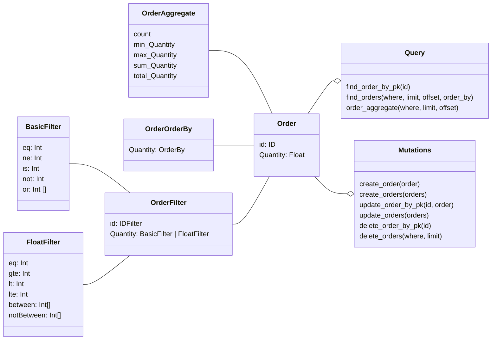

<div align="center">
  <h1>sGraph</h1>
  <h3 align="center">Turn your graphql schema into a full API</h3>
  <div>
    <a href="https://www.sgraph.dev/docs/getting-started/quickstart">Quickstart</a>
    <span>&nbsp;&nbsp;•&nbsp;&nbsp;</span>
    <a href="https://www.sgraph.dev/">Website</a>
    <span>&nbsp;&nbsp;•&nbsp;&nbsp;</span>
    <a href="https://www.sgraph.dev/docs/">Docs</a>
    <span>&nbsp;&nbsp;•&nbsp;&nbsp;</span>
    <a href="https://github.com/sgraph/examples/">Examples</a>
    <span>&nbsp;&nbsp;•&nbsp;&nbsp;</span>
    <a href="https://twitter.com/sayhava">Twitter</a>
  </div>
</div>

## What is sGraph?

`sGraph` is a schema driven GraphQL API server powered by the trusted [Sequelize SQL ORM Library](https://sequelize.org).

It is easy in 3 steps

-   Define a graphql schema
-   Provide database credentials
-   Get an API

**with a simple schema like this**

```graphql schema.graphql
type Customer @model {
    Id: ID
    ContactName: String
    Orders: [Order] @hasMany
}

type Order @model {
    Id: Int @primaryKey
    OrderDate: Date
    Freight: Float
    CustomerId: String
    Customer: Customer @belongsTo
}
```

**you get an API like this**

```graphql
{
    find_customers(where: { ContactName: { startsWith: "Anne" } }, limit: 10) {
        count
        customers {
            ContactName
            Orders {
                Freight
            }
            Orders_aggregate {
                max_Freight
            }
        }
    }
}
```

## Features

-   Instant CRUD API from a Graphql Schema
-   Extensive field filtering API. `startsWith`, `gt`, `isNot` e.t.c
-   Extensive field aggregation API. `max`, `min`, `avg` e.t.c
-   Builtin field validations with directives. e.g `@validate_max(value: 20)`, `@validate_len(value: [2, 10])` e.t.c
-   Readable scalar fields with validation e.g `URL`, `Email`, `Date` e.t.c
-   Powered by [Sequelize ORM](https://sequelize.org). Supports all the databases supported by sequelize. (`MySQL`, `SQLite`, `Postgresql`) e.t.c
-   Supports [Envelope Plugins](https://envlope.dev) Plugins e.g `JWT`, `Performance`, `Caching`
-   Easily versioned API, just version the schema
-   Serverless ready
-   Programmable via express middleware

## sGraph Use cases

-   Quickly spin up a GraphQL API for an existing database
-   Generate read-only public/client facing APIs
-   Eliminate redundant CRUD code
-   Spin up cheap serverless APIs for small to medium sized projects
-   Seamlessly integrate with your existing project via middleware, or serverless functions
-   Easily build access restrictions into API with a declarative schema

## Quick Start

with npm

```shell
npx @sayjava/sgraph --schema schema.graphql --database sqlite::memory:
```

with docker

```shell
docker run @sayjava/sgraph --schema schema.graphql --database sqlite::memory:
```

Read the [API docs](website/docs/guide/api.md) for the full set of available APIs

## Architecture



## Supported Databases

All databases supported by the `Sequelize ORM` are supported by `sGraph`

-   SQLite
-   MySQL
-   PostgresSQL
-   MariaDB
-   Microsoft SQL Server
-   Amazon Redshift
-   Snowflake’s Data Cloud

# Examples & Playground

-   Northwind
    -   [Code](northwind)
    -   [Live Playground](https://northwind.sgraph.dev)
-   Chinook [Coming Soon]
    -   [Code](chinook)
    -   [Live Playground](https://chinook.sgraph.dev)

## Documentation

-   [Server Setup](website/docs/start.md)
-   [Schema Guide](website/docs/guide/schema.mdx)
-   [API Documentation](website/docs/guide/api.md)
-   [Plugin Documentation](website/docs/plugins.md)

## Development

Install dependencies

```shell
npm i
```

Start the server

```shell
npm run dev
```
