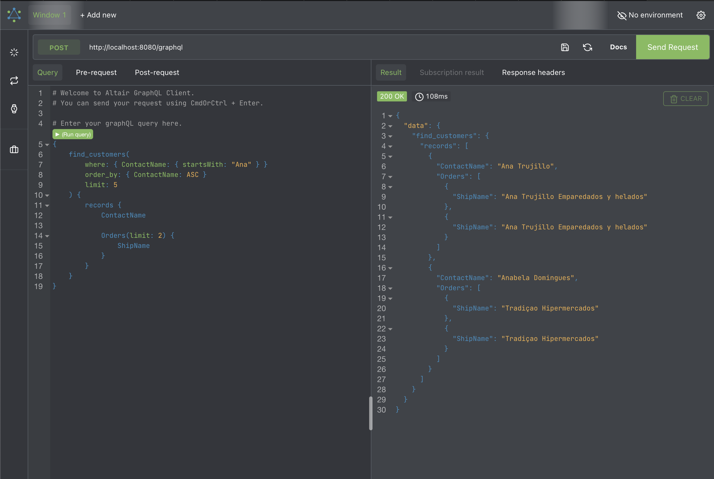

# Sgraph

A schema first approach to a graphql API

## Benefits

-   Instant CRUD API from graphql schema e.g `find_models`, `find_model_by_pk`, `create_model` e.t.c
-   Powered by [Sequelize ORM](https://https://sequelize.org). Supports all the database supported by sequelize e.g `sqlite`, `postgresql`, `mysql` e.t.c
-   [Supports Envelope Plugins e.g JWT,`Performance`,`Caching`](https://sayjava.github.com/sgraph/plugins)
-   [Serverless compatible](https://sayjava.github.com/sgraph/middleware)
-   [Programmatic express middleware](https://sayjava.github.com/sgraph/middleware)
-   [Expose only what you want via the schema](https://sayjava.github.com/sgraph/schema)

## Quick Start

```shell
npx @sayjava/sgraph --schema schema.graphql --database sqlite:northwind.sqlite
```



```graphql
type Customer @model {
    Id: String @primaryKey
    CompanyName: String
    ContactName: String

    Orders: [Order] @hasMany(foreignKey: "CustomerId")
}

type Order @model {
    Id: Int @primaryKey @autoIncrement
    OrderDate: String @dateOnly
    Freight: Float
    ShipName: String
    CustomerId: String

    Customer: Customer @belongsTo(sourceKey: "CustomerId")
}
```

Find customers with name starting with `Ana` and their `orders`

```graphql
{
    find_customers(
        where: { ContactName: { startsWith: "Ana" } }
        order_by: { ContactName: ASC }
        limit: 5
    ) {
        records {
            ContactName

            Orders(limit: 2) {
                ShipName
            }
        }
    }
}
```

Find sum of freight made by a customer

```graphql
{
    find_customer_by_pk(id: "ALFKI") {
        Orders_aggregate {
            count
            sum_Freight
        }
    }
}
```
