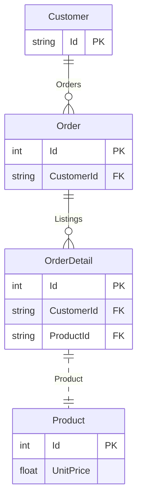
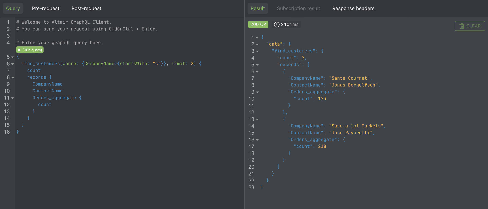

<div align="center">
<h1>sGraph</h1>
  <a href="https://www.sgraph.dev/docs/getting-started/quickstart">Quickstart</a>
  <span>&nbsp;&nbsp;•&nbsp;&nbsp;</span>
  <a href="https://www.sgraph.dev/">Website</a>
  <span>&nbsp;&nbsp;•&nbsp;&nbsp;</span>
  <a href="https://www.sgraph.dev/docs/">Docs</a>
  <span>&nbsp;&nbsp;•&nbsp;&nbsp;</span>
  <a href="https://github.com/sgraph/examples/">Examples</a>
  <span>&nbsp;&nbsp;•&nbsp;&nbsp;</span>
  <a href="https://twitter.com/sayhava">Twitter</a>
</div>

## What is sGraph?

`sGraph` is a schema driven GraphQL API server powered by the trusted [Sequelize SQL ORM Library](https://sequelize.org). It exposes

## Features

-   Instant CRUD API from a Graphql Schema
-   Extensive field filtering API. `startsWith`, `gt`, `isNot` e.t.c
-   Extensive field aggregation API. `max`, `min`, `avg` e.t.c
-   Builtin field validations with directives. e.g `@validate_max(value: 20)`, `@validate_len(value: [2, 10])` e.t.c
-   Readable scalar fields e.g `URL`, `Email`, `Date` e.t.c
-   Powered by [Sequelize ORM](https://sequelize.org). Supports all the database supported by sequelize
-   Supports [ GraphQL Envelope](https://envlope.dev) Plugins e.g `JWT`, `Performance`, `Caching`
-   Builtin [Altair GraphQL Client](https://altair.sirmuel.design/) in standalone server
-   Serverless ready
-   Express middleware

## sGraph Use cases

-   Quickly spin up a GraphQL API from an existing database
-   Read-only public facing APIs
-   Eliminate redundant CRUD code
-   Spin up cheap serverless APIs for small to medium sized projects
-   Use with SSR projects

## Quick Start

with npm

```shell
npx @sayjava/sgraph --schema schema.graphql --database sqlite::memory:
```

with docker

```shell
docker run @sayjava/sgraph --schema schema.graphql --database sqlite::memory:
```

## sGraph GraphQL Schema

```graphql
# Define types with @model directive
type Customer @model {
    Id: String @primaryKey

    # Fields with validations
    ContactName: String @validate_min(value: 10)

    # Define the associations
    Orders: [Order] @hasMany(foreignKey: "CustomerId")
}

type Order @model {
    Id: Int @primaryKey @autoIncrement

    # sGraph scalar types
    OrderDate: Date

    Freight: Float
    ShipName: String
    CustomerId: String

    # define the associations in the schema
    Customer: Customer @belongsTo(sourceKey: "CustomerId")
}
```

Find customers with name starting with `Ana` and their `orders`

```graphql
{
    find_customers(
        where: { ContactName: { startsWith: "Ana" } }
        order_by: { ContactName: ASC }
        limit: 5
    ) {
        records {
            ContactName

            Orders(limit: 2) {
                ShipName
            }

            Orders_aggregate {
                max_Freight
            }
        }
    }
}
```

Read the [API docs](website/docs/guide/api.md) for the full set of available APIs

## Supported Databases

All databases supported by the `Sequelize ORM` are supported by `sGraph`

-   SQLite
-   MySQL
-   PostgresSQL
-   MariaDB
-   Microsoft SQL Server
-   Amazon Redshift
-   Snowflake’s Data Cloud

## Playground

Using a sample Northwind Sample Database



Have a feel for the `sGraph API` with the live [Northwind Sample Database Playground](https://northwind.sgraph.dev).



## Development

Install dependencies

```shell
npm i
```

Run development server

```shell
npm run dev
```
