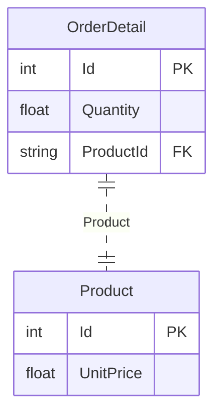
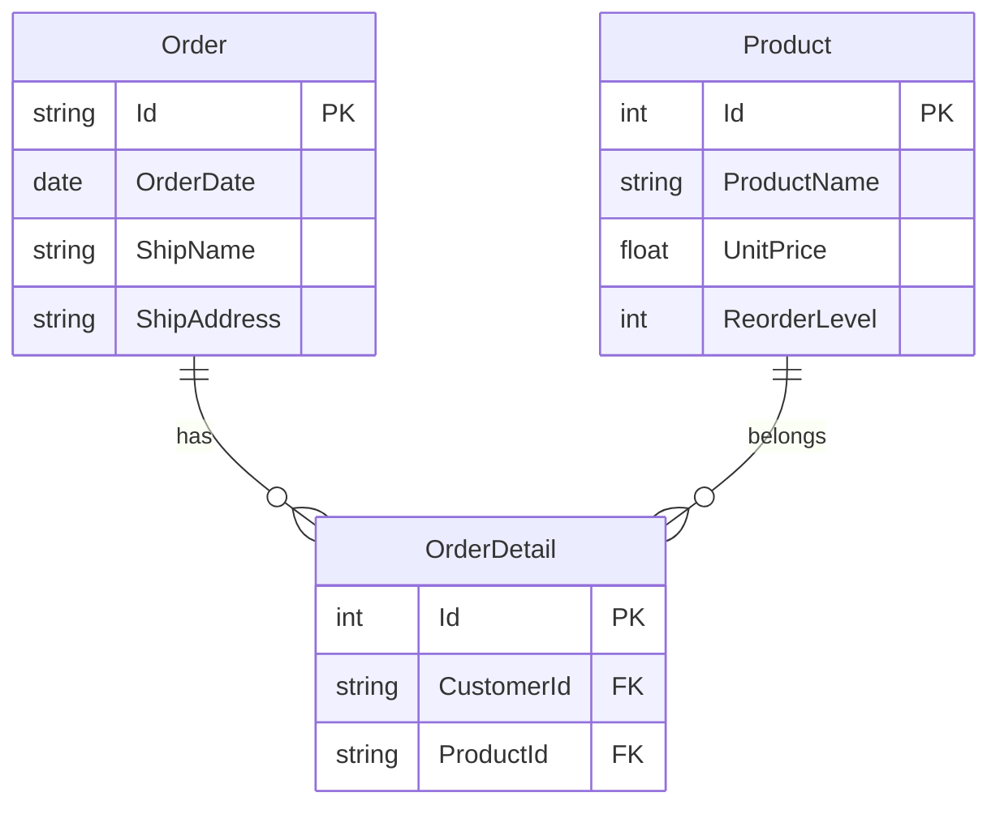

`sGraph` uses a `schema first` approach to GraphQL API development. The behavior of the API is used to mostly controlled by the type definitions and their associations in the schema.

Here is the simplest form of a type definition in a schema. This type is mapped to an underlying table in the database

```graphql
type Employee @model {
    # This corresponds to the primary key of the Employee table
    Id: ID

    FirstName: String
    LastName: String
}
```

### Architecture

`sGraph` is powered by [Sequelize ORM](https://www.sequelize.org), so underneath, each defined type in the schema is mapped directly to a sequelize model which is in turn mapped to a database table. Each defined type in the schema will be mapped to a corresponding table in the underlying database.

<mermaid>
classDiagram
    SchemaEmployee <|.. SequelizeEmployee: Mapped
    class SchemaEmployee {
        string Id
        string FirstName
        string LastName
    }
    class SequelizeEmployee {
        string Id
        string FirstName
        string LastName
    }
</mermaid>

## Definition

`sGraph` schema uses a collection of directives to influence how the eventual API is generated. The generated APIs are dynamic therefore, any changes in the schema will be reflected in API when the server is restarted.

### Primary Key

Every type requires at least one field marked as the `@primaryKey` or typed as `ID` and this will correspond to the `primary key` field of the underlying database table. The name of the type is used to map to the SQL table.

<Tabs>
<TabItem value="id" label="By ID">

```graphql
type Employee {
    Id: ID
}
```

</TabItem>
<TabItem value="directive" label="By Directive">

```graphql
type Employee {
    Id: Int @primaryKey
}
```

</TabItem>
</Tabs>

### Modelling

| Directive        | Description                                                                                                                            | Args                                                                   | Default Behavior                                     |
| ---------------- | -------------------------------------------------------------------------------------------------------------------------------------- | ---------------------------------------------------------------------- | ---------------------------------------------------- |
| `@model`         | Maps a type to a database table using the Type name. The name can be modified by the `tableName` argument                              | `{ tableName: String }`                                                | The type name will used for the SQL Table name       |
| `@autoTimestamp` | Automatically creates `createdAt` and `updatedAt` fields for types                                                                     | none                                                                   | now                                                  |
| `@crud`          | Controls what CRUD API is generated for this type. In some cases, it might be helpful to disable mutations on a public API for example | `{ create: Boolean, read: Boolean, update: Boolean, delete: Boolean }` | Full CRUD is enabled by default                      |
| `@autoIncrement` | Marks a field to auto increment                                                                                                        |                                                                        | Auto increment this field                            |
| `@column`        | Remaps a field to a column in the database                                                                                             | `{ name: String }`                                                     | The field name maps directly to the database columns |

**Example Schema**

```graphql
type Employee
    @model(tableName: "employees")
    @autoTimestamp
    @crud(delete: false) {
    id: ID
    logins: Int @autoIncrement
    firstName: String @column(name: "FirstName")
}
```

### Special Scalar Types

`sGraph` ships with special scalar types that are automatically validated before insertion into the database and makes the schema more readable and contextual

| Type         | Description                               | Underlying Type           |
| ------------ | ----------------------------------------- | ------------------------- |
| `UUID`       | UUIDV4                                    | UUID                      |
| `Email`      | Email formatted field                     | String                    |
| `DateTime`   | Database timestamp                        | Date, defaults to now     |
| `Date`       | Date only (without the time component)    | DateTime, defaults to now |
| `URL`        | URL formatted field                       | String                    |
| `CreditCard` | Credit card formatted field               | String                    |
| `IPV4`       | IP address version 4                      | String                    |
| `IPV6`       | IP address version 6                      | String                    |
| `JSON`       | JSON format for databases that support it | JSON                      |

:::info

These scalar fields are automatically validated before insertion into the database except for the JSON type

:::

**Example Schema**

```graphql
type Post @model(tableName: 'Posts') @autoTimestamp {
    id: UUID @primaryKey
    permalink: URL! @column(name: "perma_link")
    authorId: Email
    origin: IPV4
    content: JSON
    birthday: Date
}
```

### Field Validations

`sGraph` supports all the validations supported by [Sequelize](https://sequelize.org/v7/manual/validations-and-constraints.html). Validations are applied before insertion into the database.

| Directive                  | Description                                                   | Args             |
| -------------------------- | ------------------------------------------------------------- | ---------------- |
| `@validate_isAlpha`        | will only allow letters                                       | None             |
| `@validate_isAlphanumeric` | will only allow alphanumeric characters, so "\_abc" will fail | None             |
| `@validate_isNumeric`      | will only allow numbers                                       | None             |
| `@validate_isLowercase`    | checks for lowercase                                          | None             |
| `@validate_isUppercase`    | checks for uppercase                                          | None             |
| `@validate_notEmpty`       | don't allow empty strings                                     | None             |
| `@validate_equals`         | only allow a specific value                                   | `value: String`  |
| `@validate_contains`       | force specific substrings                                     | `value: String`  |
| `@validate_len`            | only allow values with a certain length                       | `value: [Int!]!` |
| `@validate_isAfter`        | only allow date strings after a specific date                 | `value: String`  |
| `@validate_isBefore`       | only allow date strings before a specific date                | `value: String`  |
| `@validate_max`            | only allow values below this max                              | `value: Int`     |
| `@validate_is`             | matches this a RegExp                                         | `value: String`  |
| `@validate_not`            | does not match a RegExp                                       | `value: String`  |

**Example Schema**

```graphql
type Profile @model {
    id: ID @primaryKey

    # Validate post code
    postcode: String @validate_is(value: "[A-Z]{1,2}[0-9][0-9A-Z]?\s?[0-9][A-Z]{2}")

    # Title must be Mr|Mrs
    title: String @validate_contains(value: "Mr")

    #  Must be at least 18 years
    dob: String @validate_isAfter(value: "2004-01-01")

    # Address is of 20 characters long
    address: String @validate_len(value: 20)
}
```

## Associations

`sGraph` supports all the types of associations supported by the [Sequelize ORM](https://sequelize.org/v7/manual/assocs.html) and the respective parameters.

Here are the supported associations that are directly mapped to the associations supported by `Sequelize`. All association options supported by Sequelize are also supported.

| Database Relationship | Directive               |
| --------------------- | ----------------------- |
| One-to-One            | `@belongsTo`, `@hasOne` |
| One-to-Many           | `@hasMany`              |
| Many-to-Many          | `@belongsToMany`        |

What directive to use depends on the typ of relationship between the types and the source of that relationship

### One-to-One relationships

To model a `one-to-one` relationship, use both the `@hasOne` and `@belongsTo` directive to create single direction or bi-directional relationship between types.

#### @belongsTo

Using this example below, an `OrderDetail` references a `Product`, therefore it (`OrderDetails`) holds the key to the relationship between it and the `Product`.



In this case an `OrderDetail` is said to **belong** to a `Product` because `OrderDetail` owns the relationship. `OrderDetail` is referred to as the **source type** and `Product` is the **target type**. The **source type** defines the relationship

```graphql
type Customer @model {
    Id: ID
    ContactName: String
    Orders: [Order] @hasMany(onDelete: "CASCADE")
}

type Order @model {
    Id: Int @primaryKey @autoIncrement
    OrderDate: Date
    Freight: Float
    CustomerId: String
    Customer: Customer
        @belongsTo(foreignKey: "CustomerId", onDelete: "SET NULL")
}
```

```graphql
{
    find_orderdetails(limit: 1) {
        orderdetails {
            Product {
                ProductName
            }
        }
    }
}
```

**Options**

| Argument       | Description                                            | Options                                                               | Default    |
| -------------- | ------------------------------------------------------ | --------------------------------------------------------------------- | ---------- |
| **foreignKey** | Set a custom `foreignKey` to used for the relationship |                                                                       |            |
| **sourceKey**  | Customize field in the source for the relationship     |                                                                       |            |
| **onDelete**   | The behavior if the target model is deleted            | `RESTRICT` \| `CASCADE` \| `NO ACTION` \| `SET DEFAULT` \| `SET NULL` | `SET NULL` |
| **onUpdate**   | The behavior if the target model is updated            | `RESTRICT` \| `CASCADE` \| `NO ACTION` \| `SET DEFAULT` \| `SET NULL` | `SET NULL` |

### One-to-Many

Modelling `one-to-many` database relationships

<mermaid>
erDiagram
Customer ||--o{ Order: has_orders
Order {
    string Id PK
    string ShipCountry
    string CustomerId FK
}
Customer {
    string Id PK
    string ContactName
}
</mermaid>

```graphql
type Customer @model {
    ID: String
    ContactName: String

    Orders: [Order] @hasMany(foreignKey: 'CustomerId')
}

type Order @model {
    Id: ID
    ShipCountry: String
    CustomerId: String
}
```


```graphql
{
    find_customers(limit: 2) {
        customers {
            Orders(limit: 5) {
                ShippedDate
            }
        }
    }
}
```


### Many-to-Many

Modelling `many-to-many` relationships




```graphql
type Order @model {
    Id: ID
    OrderDate: Date

    Products: [Product] @belongsToMany(through: "OrderDetail")
}

type OrderDetail @model {
    Id: ID
    Quantity: Float

    # The many-to-many relationship expects these Ids to exist on this table in this exact format. i.e ModelId
    # If this not the case, the column name can be mapped instead.
    OrderId: String
    # This is an example of how to keep the schema rules mapped to the underlying database
    ProductId: String @column(name: "ProductId")

    Order: Product @belongsTo(sourceKey: "OrderId")
    Product: Product @belongsTo(sourceKey: "ProductId")
}

type Product @model {
    Id: ID
    ProductName: String
    UnitPrice: Float
}
```


```graphql
# Find the products attached to an order with price greater than 20
{
    find_orders(limit: 1) {
        orders {
            Products(where: { UnitPrice: { gt: 20 } }) {
                UnitPrice
                ProductName
            }
        }
    }
}
```

:::info
To successfully model a `many-to-many` relationship, remember to make sure that the joint table has the respective `ModelId` columns or map them in the schema as the schema above
:::

### Self Referential Relationships

Combining `@belongsTo` and `@hasMany` to model a self referential relationships.

In this example, an `Employee` can `manage` other employees but can also be `managed` by another employee.

<mermaid>
erDiagram
    Employee |o..o| Employee: Manager
    Employee }o..o{ Employee: Manages
    Employee {
        int Id
        string FirstName
        int ReportsTo FK
    }
</mermaid>


```graphql
type Employee @model {
    Id: Int @primaryKey
    FirstName: String
    ReportsTo: Int

    Manager: Employee @belongsTo(foreignKey: "ReportsTo")
    Manages: [Employee] @hasMany(foreignKey: "ReportsTo")
}
```


```graphql
{
    find_employee_by_pk(id: 5) {
        FirstName
        Manager {
            FirstName
        }
        Manages {
            FirstName
        }
        Manages_aggregate {
            count
        }
    }
}
```

