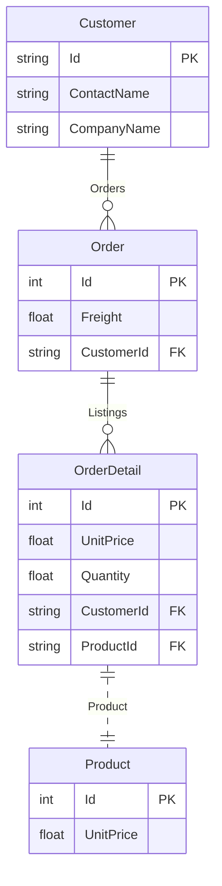

`sGraph` supports all the different types of associations supported by [sequelize](https://sequelize.org/v7/manual/assocs.html) and the parameters

Here are the supported associations that are directly mapped to the associations supported by `Sequelize`. All association options supported by Sequelize are also supported.

| Association             | Directive        |
| ----------------------- | ---------------- |
| One-to-One, Many-to-One | `@belongsTo`     |
| Many-to-One             | `@hasMany`       |
| Many-to-Many            | `@belongsToMany` |
| One-to-One              | `@hasOne`        |

This documentation will use this example schema to illustrate the associations



## One-to-One

```graphql

```

**Self Referential**

```graphql

```

**Sample Query**

```graphql

```

## One-to-Many

```graphql {5,12}
 type Customer @model {
    Id: String @primaryPk
    ContactName: String

    Orders: [Order] @hasMany(foreignKey: 'CustomerId')
 }

 type Order @model {
    Id: Int @primaryKey
    CustomerId: String

    Customer: Customer @belongsTo(sourceKey: 'CustomerId')
 }

```

## Many-to-Many

```graphql
type Customer @model {
    Id: String @primaryPk
    ContactName: String

    Products: [Product] @belongsToMany(through: "OrderDetail")
}
```

**Sample Query**

```graphql
    find_customers_byPk(id: 'some-id') {
        products {
            ProductName
        }
    }
```

:::info
Remember to use `@column` to map this because sequelize expects this column to be `ModelId`
:::

## Referential Integrity
