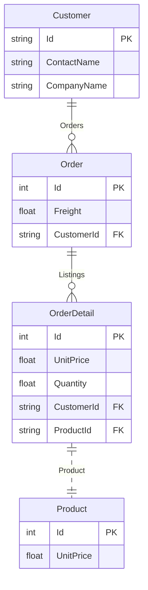

`sGraph` uses a `schema first` approach to GraphQL API development. The behavior of the API is used to mostly controlled by the type definitions and their relationships in the schema. Each defined GraphQL Type must be mapped to a database SQL table for an API to be generated for that type.

**Example Schema**

```graphql
type Employee @model {
    Id: Int @primaryKey
    FirstName: String
    LastName: String
}
```

## Declaration

Every type requires at least one field marked as the `@primaryKey` and this should correspond to the primary key field of the underlying database table. The name of the type is used to map to the SQL table.

| Directive          | Description                                                                                                                            | Args                                                                   | Default Behavior                               |
| ------------------ | -------------------------------------------------------------------------------------------------------------------------------------- | ---------------------------------------------------------------------- | ---------------------------------------------- |
| **@model**         | Maps a type to a database table using the Type name. The name can be modified by the `tableName` argument                              | `{ tableName: String }`                                                | The type name will used for the SQL Table name |
| **@autoTimestamp** | Automatically injects `createdAt` and `updatedAt`                                                                                      | none                                                                   | now                                            |
| **@crud**          | Controls what CRUD API is generated for this type. In some cases, it might be helpful to disable mutations on a public API for example | `{ create: Boolean, read: Boolean, update: Boolean, delete: Boolean }` | Full CRUD is enabled by default                |
| **@autoIncrement** | Marks a field to auto increment                                                                                                        |                                                                        | Auto increment this field                      |

### Special Scalar Types

`sGraph` ships with special scalar types that are automatically validated before insertion into the database.

| Type           | Description                               | Underlying Type           |
| -------------- | ----------------------------------------- | ------------------------- |
| **UUID**       | UUID.                                     | UUID, defaults to UUID    |
| **Email**      | Email Format                              | String                    |
| **DateTime**   | Timestamps                                | Date, defaults to now     |
| **Date**       | Date Only                                 | DateTime, defaults to now |
| **URL**        | URL RFC format                            | String                    |
| **CreditCard** | Credit card format                        | String                    |
| **IPV4**       | IP address version 4                      | String                    |
| **IPV6**       | IP address version 6                      | String                    |
| **JSON**       | JSON format for databases that support it | JSON                      |

**Example Schema**

```graphql
type Post {
    id: UUID @primaryKey
    permalink: URL!
    authorId: Email!
    origin: IPV4
    content: JSON
}
```

:::info

These scalar fields are automatically validated before insertion into the database except for the JSON type

:::

### Field Validations

`sGraph` supports all the validations supported by [Sequelize](https://sequelize.org/v7/manual/validations-and-constraints.html). Validations that are applied before insertion into the database.

| Directive                    | Description                                                   | Args             |
| ---------------------------- | ------------------------------------------------------------- | ---------------- |
| **@validate_isAlpha**        | will only allow letters                                       | None             |
| **@validate_isAlphanumeric** | will only allow alphanumeric characters, so "\_abc" will fail | None             |
| **@validate_isNumeric**      | will only allow numbers                                       | None             |
| **@validate_isLowercase**    | checks for lowercase                                          | None             |
| **@validate_isUppercase**    | checks for uppercase                                          | None             |
| **@validate_notEmpty**       | don't allow empty strings                                     | None             |
| **@validate_equals**         | only allow a specific value                                   | `value: String`  |
| **@validate_contains**       | force specific substrings                                     | `value: String`  |
| **@validate_len**            | only allow values with a certain length                       | `value: [Int!]!` |
| **@validate_isAfter**        | only allow date strings after a specific date                 | `value: String`  |
| **@validate_isBefore**       | only allow date strings before a specific date                | `value: String`  |
| **@validate_max**            | only allow values below this max                              | `value: Int`     |
| **@validate_is**             | matches this a RegExp                                         | `value: String`  |
| **@validate_not**            | does not match a RegExp                                       | `value: String`  |

## Associations

`sGraph` supports all the different types of associations supported by the [Sequelize ORM](https://sequelize.org/v7/manual/assocs.html) and the respective parameters.

Here are the supported associations that are directly mapped to the associations supported by `Sequelize`. All association options supported by Sequelize are also supported.

| Association             | Directive        |
| ----------------------- | ---------------- |
| One-to-One, Many-to-One | `@belongsTo`     |
| Many-to-One             | `@hasMany`       |
| Many-to-Many            | `@belongsToMany` |
| One-to-One              | `@hasOne`        |

To illustrate how to define associations in a schema, this documentation will use this sample entity relationship.



### One-to-One

```graphql

```

**Self Referential**

```graphql

```

**Sample Query**

```graphql

```

### One-to-Many

```graphql {5,12}
 type Customer @model {
    Id: String @primaryPk
    ContactName: String

    Orders: [Order] @hasMany(foreignKey: 'CustomerId')
 }

 type Order @model {
    Id: Int @primaryKey
    CustomerId: String

    Customer: Customer @belongsTo(sourceKey: 'CustomerId')
 }

```

### Many-to-Many

```graphql
type Customer @model {
    Id: String @primaryPk
    ContactName: String

    Products: [Product] @belongsToMany(through: "OrderDetail")
}
```

**Sample Query**

```graphql
    find_customers_byPk(id: 'some-id') {
        products {
            ProductName
        }
    }
```

:::info
Remember to use `@column` to map this because sequelize expects this column to be `ModelId`
:::

### Referential Integrity

## Example Type Definition

```graphql
"""
sGraph will generate a Read-Only API for this type
"""
type Employee
    @autoTimestamp
    @model(tableName: 'employees')
    @crud(create: false, update: false, delete: false) {

    id: UUID! @primaryKey

    logs: Int! @autoIncrement

    """ UK passport number """
    passport: String! @validate_is(value: "^[0-9]{10}GBR[0-9]{7}[U,M,F]{1}[0-9]{9}$")

    """ Maps this field to a different table column  """
    email: Email @column(name: 'employee_email')

    url: URL

    """ Must be a phone number """
    phoneNumber:  String @validate_isNumeric

    """ No date will be accepted after this date """
    registeredDate: Date  @validate_isBefore(value: '27-04-1990')

    """ Postcode must contain ECR1  """
    postcode: String  @validate_contains(value: 'ECR1')
}
```
